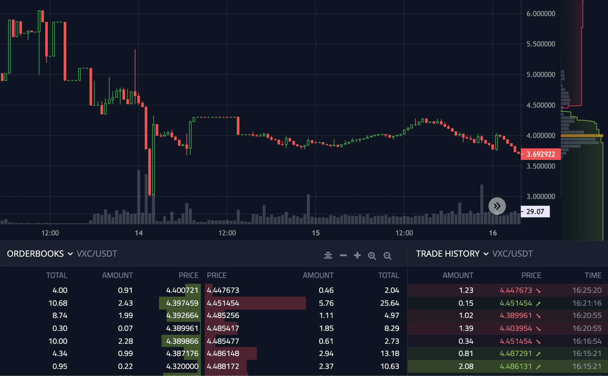
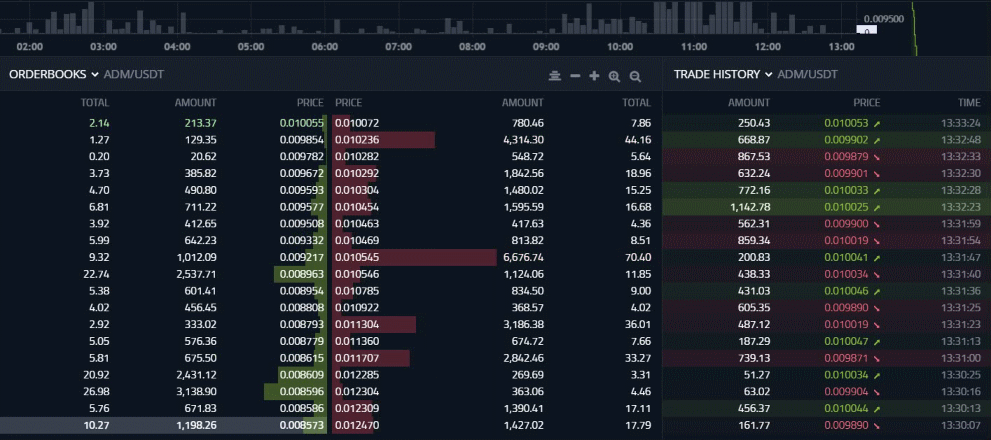

ADAMANT Trading & Market making bot is a software that allows to run trades on crypto exchanges, make trade volume, maintain spread and liquidity, set price range, and build live-like dynamic order book.

This is a free version. For premium features, see [marketmaking.app/services](https://marketmaking.app/services/).

# Market making

In Market-making mode, the bot places orders and executes them by itself, making a trading volume, maintaining spread and liquidity; builds live-like dynamic order books, and watches a token price. Market making helps:

* Cryptocurrency projects (token issuers)
* Cryptocurrency exchanges

See [marketmaking.app](https://marketmaking.app) to look at the bot possibilities.





# Profit trading

Profit trading is a mode in which a bot runs orders according to some strategy. For Profit trading, see other software—[CoinOptimus](https://github.com/Adamant-im/adamant-coinoptimus).

# Features

* Easy to install and configure
* Initial fill order books
* Dynamic order book building
* Place buy and sell limit or market orders
* Market making with 3 policies: spread, orderbook, optimal
* Spread & liquidity maintenance
* Price range setting
* Arbitrage token price on other trade pairs or exchanges
* Managed with your commands using ADAMANT Messenger

# Supported exchanges

* [P2PB2B](https://p2pb2b.com)
* [Azbit](https://azbit.com?referralCode=9YVWYAF)
* [StakeCube](https://stakecube.net/?team=adm)
* [Coinstore](https://h5.coinstore.com/h5/signup?invitCode=o951vZ)
* [FameEX](https://www.fameex.com/en-US/commissiondispense?code=MKKAWV)
* [NonKYC](https://nonkyc.io?ref=655b4df9eb13acde84677358)

To add other exchange support, see [marketmaking.app/services](https://marketmaking.app/services/).

# Usage and Installation

After installation, you control the bot in secure ADAMANT Messenger chat directly.

Available commands: ask a bot with the `/help` command. Read more about installing and using the bot: [marketmaking.app/guides](https://marketmaking.app/guides/).

We can run market-making for you, see [marketmaking.app/services](https://marketmaking.app/services/).

## Requirements

* Ubuntu 18–22, centOS 8 (we didn't test others)
* NodeJS v16+
* MongoDB v6+ ([installation instructions](https://docs.mongodb.com/manual/tutorial/install-mongodb-on-ubuntu/))

## Setup

```
su - adamant
git clone https://github.com/Adamant-im/adamant-tradebot
cd ./adamant-tradebot
npm i
```

## Pre-launch tuning

The bot will use `config.jsonc`, if available, or `config.default.jsonc` otherwise.

```
cp config.default.jsonc config.jsonc
nano config.jsonc
```

Parameters: see comments in the config file.

## Launching

You can start the Bot with the `node app` command, but it is recommended to use the process manager for this purpose.

```
pm2 start app.js --name tradebot
```

## Add a Bot to cron

```
crontab -e
```

Add string:

```
@reboot cd /home/adamant/adamant-tradebot && pm2 start app.js --name tradebot
```

## Updating

```
su - adamant
cd ./adamant-tradebot
pm2 stop tradebot
git pull
npm i
```

Update `config.jsonc` if `config.default.jsonc` changed.

Then `pm2 restart tradebot`.
