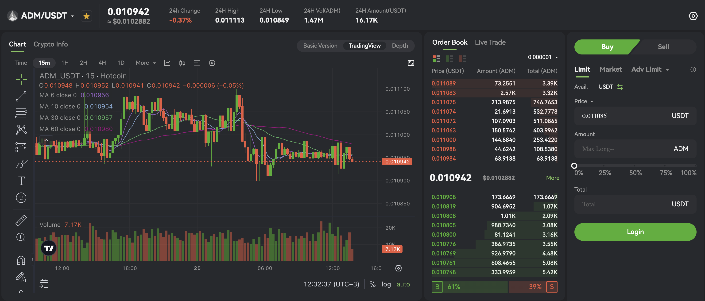
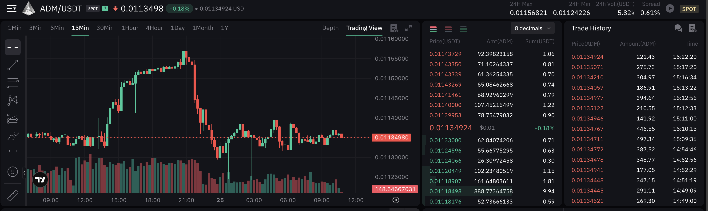
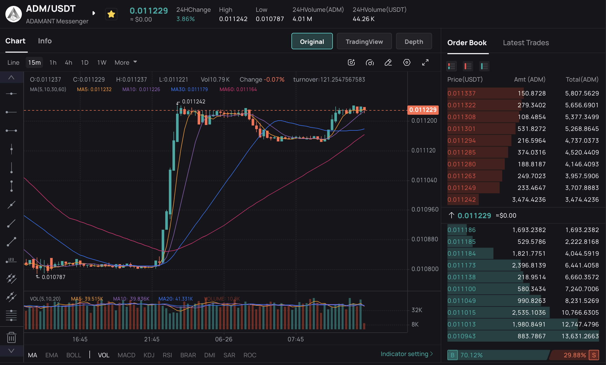
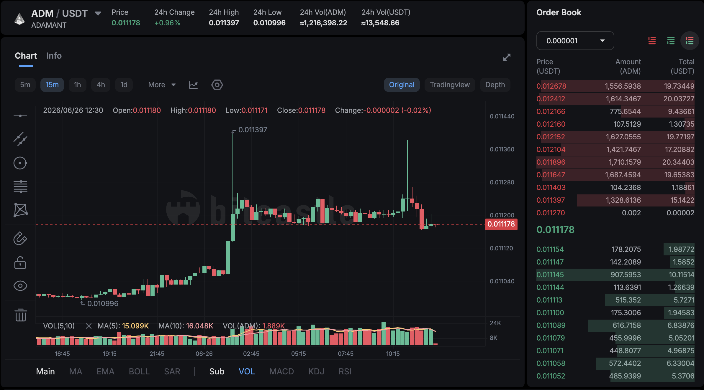

# ADAMANT Market-Making Software

**Free self-hosted market-making toolkit for token issuers.**

Improve your token’s CEX market quality without sending your tokens, funds, or API keys to a third-party market maker.

ADAMANT Market-Making Software runs on your own server, uses your own exchange account, and helps maintain order book depth, tighter spreads, price ranges, and live-like market activity on supported centralized exchanges.

> No token custody.  
> No fund transfer.  
> No third-party API key access.  
> Full control over configuration, monitoring, and execution.










## Why token projects use it

A CEX listing is not enough.

If your order book is thin, the spread is wide, or even small trades move the price too much, new traders may see risk before they see your project.

ADAMANT Market-Making Software helps token issuers operate their own liquidity setup instead of handing control to an external black-box market maker.

It is designed for projects that want to:

- Improve order book depth
- Maintain tighter spreads
- Reduce empty-book and gap effects
- Keep price activity within configured ranges
- Monitor liquidity operations transparently
- Stay in control of their own exchange accounts
- Avoid sending tokens or funds to an outside market maker

## Trusted by design

ADAMANT Market-Making Software is not a black-box market-making service.

It is open-source software backed by ADAMANT — a 10-year open-source crypto project with public repositories, long-term community history, and production infrastructure.

You can inspect the code, run the software yourself, monitor its behavior, and keep your exchange access under your own control.

## Who it is for

ADAMANT Market-Making Software is built for:

- Token issuers after CEX listing
- Crypto projects with thin order books or wide spreads
- Teams that want to improve market quality without transferring tokens or funds to a third party
- Projects that prefer open-source, self-hosted, transparent market operations
- Small and early-stage token projects that need a free basic market-making toolkit to start
- Mid-size and large crypto projects that need advanced market-making features, custom exchange support, setup assistance, and ongoing technical support through the premium version
- Teams that cannot afford, do not want, or do not fully trust a traditional full-service market maker

ADAMANT Market-Making Software helps token issuers improve CEX market quality without handing control to a third-party market maker.

It is designed to address the most common problems after listing:

| Situation | Pain |
|---|---|
| Token is already listed | But the order book looks empty or weak |
| Spread is too wide | Traders see risk and avoid entering |
| Liquidity is thin | Even small orders move the price |
| Full-service market making is too expensive | Retainers, token loans, opaque terms |
| Team does not trust third parties | Fear of token dumping, API misuse, or hidden execution |
| Project wants transparency | The software runs on their own server, under their own monitoring |

## What it does

The free basic version helps operate essential market-making activity on supported centralized exchanges.

### Basic features

- Self-hosted deployment
- No third-party access to your exchange API keys
- No token or fund transfer to an external market maker
- Initial order book filling
- Dynamic order book building
- Buy and sell limit orders
- Buy and sell market orders
- Spread maintenance
- Basic liquidity and depth support
- Price range settings
- Trading activity with configurable policies:
  - Spread
  - Order book
  - Optimal
  - Depth
- Reference price / arbitrage logic across trading pairs or exchanges
- Account information:
  - Exchange fees
  - Daily volume
  - Balances
  - Orders
  - Bot statistics
- Command aliases
- Management via ADAMANT Messenger—secure command-based control without exposing a public admin panel

## Supported exchanges

The free basic version supports selected centralized exchanges:

- [Azbit](https://azbit.com)
- [P2PB2B](https://p2pb2b.com)
- [StakeCube](https://stakecube.net)
- [Coinstore](https://coinstore.com)
- [FameEX](https://www.fameex.com)
- [NonKYC](https://nonkyc.io)

Need another exchange?

Premium and custom exchange support is available for other CEXs.

## Limited onboarding offer

Your exchange is not supported yet? We may add a connector to your exchange for free or with a special discount as part of the onboarding campaign.

Offer valid until **September 1, 2026**—contact us.

## Premium features and support

The free basic version is suitable for getting started with self-hosted liquidity operations on supported exchanges.

Premium modules and services are available for projects that need advanced market quality, safer liquidity management, additional exchange support, custom setup, or ongoing technical support.

Premium options may include:

- Advanced liquidity and depth control
- Safer liquidity strategies
- Better spread maintenance
- In-spread orders
- No-gap order book logic
- Smoother chart behavior
- DEX price watcher
- Anti-cheat and cleaner logic
- Additional exchange connectors
- WebUI access
- Setup assistance
- Configuration tuning
- Ongoing support

See premium features:

[https://marketmaking.app/cex-mm/mm-features/](https://marketmaking.app/cex-mm/mm-features/)

## Usage and installation

After installation, you control the software from your own environment.

The software is self-hosted. You keep control of the exchange account, API keys, funds, tokens, configuration, and execution.

For additional management options, including Telegram, CLI, and WebUI access, request a manager.

## Requirements

- Ubuntu 20+ or CentOS 8+ (other Linux distros may work but are not tested)
- Node.js v22.2+
- npm v9+
- MongoDB ([installation instructions](https://www.mongodb.com/docs/manual/administration/install-community/)

## Setup

```bash
su - adamant
git clone https://github.com/Adamant-im/adamant-tradebot
cd adamant-tradebot
npm i
```

## Pre-launch tuning

The bot uses `config.jsonc` if present, otherwise `config.default.jsonc`.
For named configs, use `config.<name>.jsonc` and pass `<name>` as a launch argument.

```bash
cp config.default.jsonc config.jsonc
nano config.jsonc
```

Parameter descriptions are in comments inside `config.jsonc`.

## Launching

You can start the bot with `node app.js`, but a process manager is recommended.

### NPM scripts

```bash
npm start                               # config.default.jsonc or config.jsonc
npm run start:config -- <name>          # config.<name>.jsonc
npm run start:dev                       # config.dev.jsonc
npm run clear                           # clear DB for default config
npm run clear:config -- <name> clear_db # clear DB for config.<name>.jsonc
```

### PM2

```bash
pm2 start app.js --name tradebot
```

With a named config:

```bash
pm2 start app.js --name tradebot-p2b -- p2b_mmtest
```

Add the process to `pm2 startup` or cron so it restarts on reboot.

## Updating

```bash
su - adamant
cd adamant-tradebot
pm2 stop tradebot
git pull
npm i
```

If `config.default.jsonc` changed, merge new fields into your `config.jsonc`.

Then:

```bash
pm2 restart tradebot
```

## Quick start with `mm` CLI

The `mm` command simplifies install, configuration, and day-to-day operation. It works in **npm/local** mode and **Docker Compose** mode.

### Install via npm

```bash
npm install -g adamant-tradebot
mkdir my-bot && cd my-bot
mm init
mm doctor
mm on
mm status
```

Both `mm` and `adamant-tradebot` are available as CLI aliases.

### Install via Docker Compose

```bash
git clone https://github.com/Adamant-im/adamant-tradebot
cd adamant-tradebot
./mm init
./mm doctor
./mm on
./mm status
```

The stack runs `mm-app` and MongoDB (`mongo:8`). User data is stored in `./docker/config`, `./docker/trade-config`, and `./docker/logs` (gitignored).

### Command reference

| Command | Description |
| --- | --- |
| `mm init` | Interactive first-time setup wizard |
| `mm on` | Start the bot (preflight `doctor`, no duplicate instance) |
| `mm off` | Stop the bot (`--all` also stops MongoDB in Docker) |
| `mm restart` | Restart the bot |
| `mm status` | Installation, process, and health summary (`--json`, `--short`) |
| `mm config` | View or change config parameters (`--edit`, `--restart`) |
| `mm doctor` | Diagnose config, MongoDB, exchange API, and runtime |
| `mm logs` | Show logs (`-f`, `--tail`, `--since`, `--level`, `--grep`) |
| `mm update` | Update the app without touching user config (`--check`) |

Use `--mode npm` or `--mode docker` when auto-detection is ambiguous.

## Documentation

- [Installation and usage guide](https://marketmaking.app/cex-mm/installation/)
- [Command reference](https://marketmaking.app/cex-mm/command-reference/)

## Tests & Developer tools

See [CONTRIBUTING.md — Tests](CONTRIBUTING.md#tests) for Jest suites, interactive simulators, and live exchange scripts.

## Contact

Want to try it for your token project or request exchange support?

Email:

[mm@adamant.im](mailto:mm@adamant.im)

ADAMANT Messenger:

[ADAMANT Business](https://adm.im/?address=U8879792970017145825&label=ADAMANT+Market+Making)

Telegram:

[@adamant_business](https://t.me/adamant_business)

## Important note

Market making and liquidity operations must comply with exchange rules and applicable laws.

ADAMANT Market-Making Software is self-hosted software. You configure it, run it, and remain responsible for how it is used.
