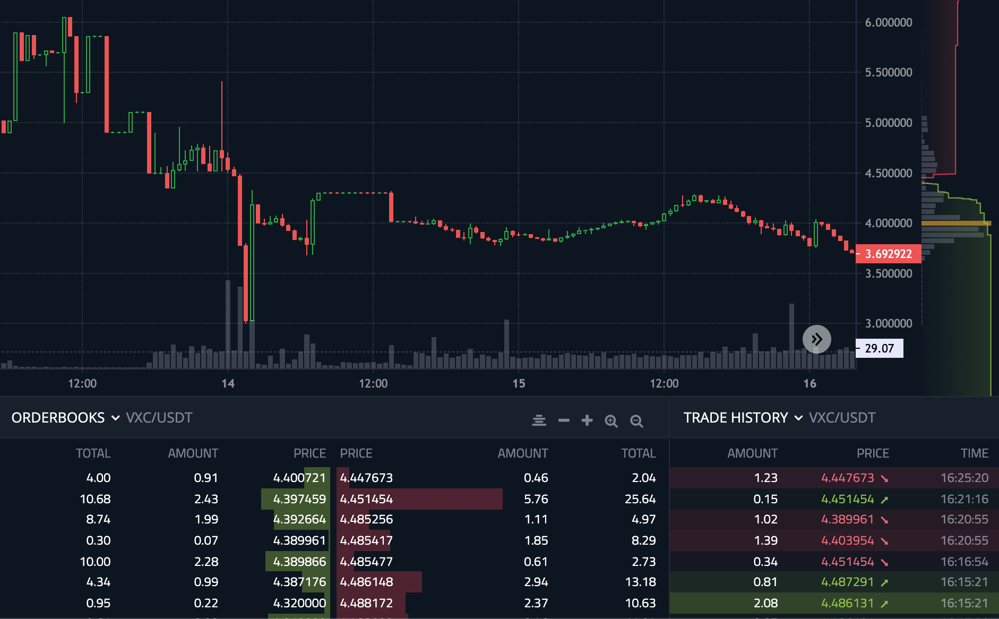
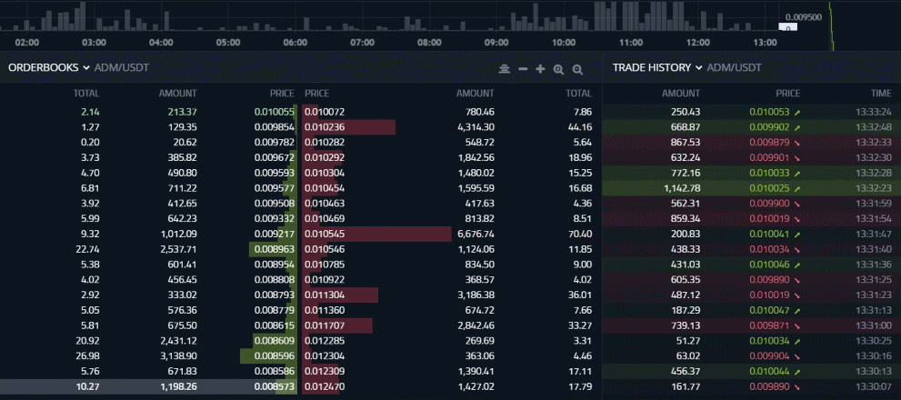

ADAMANT Market-making bot is self-hosted software that runs trades on crypto exchanges, generates trading volume, maintains spread and liquidity, sets price ranges, and builds live-like dynamic order books.

This is the free version — suitable for small crypto projects with low liquidity, traded on centralized exchanges from the open list.

For premium features, see [https://marketmaking.app/cex-mm/mm-features](https://marketmaking.app/cex-mm/mm-features/).

Market-making helps:

* Cryptocurrency projects (token issuers)
* Cryptocurrency exchanges





# Features (Basic MM bot)

* Self-hosted — never share your exchange API keys
* Easy to install and configure
* Initial order book filling
* Dynamic order book building (basic)
* Watch order books and eliminate gaps
* Place buy and sell limit or market orders
* Trading volume with four policies: spread, orderbook, optimal, and depth
* Spread and liquidity/depth maintenance (basic)
* Price range settings
* Arbitrage token price across trade pairs or exchanges
* Account info: fees and daily volume
* Command aliases
* Managed via ADAMANT Messenger, Telegram, or WebUI

# Supported exchanges (Basic MM bot)

* [Azbit](https://azbit.com?referralCode=9YVWYAF)
* [P2PB2B](https://p2pb2b.com)
* [StakeCube](https://stakecube.net/?team=adm)
* [Coinstore](https://coinstore.com)
* [FameEX](https://www.fameex.com)
* [NonKYC](https://nonkyc.io/?ref=655b4df9eb13acde84677358)

# Premium features and exchange support

For premium features and using the MM bot on any CEX, see [MM Bot Features](https://marketmaking.app/cex-mm/mm-features/).

# Usage and installation

After installation, you control the bot in a secure ADAMANT Messenger chat. The bot is self-hosted.

For additional bot management options, including Telegram, CLI and Web UI access, request a manager account at https://marketmaking.app.

* [Installation and usage guide](https://marketmaking.app/cex-mm/installation/)
* [Command reference](https://marketmaking.app/cex-mm/command-reference/)

## Requirements

* Ubuntu 20+ or CentOS 8+ (other Linux distros may work but are not tested)
* Node.js v22.2+
* npm v9+
* MongoDB ([installation instructions](https://www.mongodb.com/docs/manual/administration/install-community/)

## Setup

```bash
su - adamant
git clone https://github.com/Adamant-im/adamant-tradebot
cd adamant-tradebot
npm i
```

## Pre-launch tuning

The bot uses `config.jsonc` if present, otherwise `config.default.jsonc`.
For named configs, use `config.<name>.jsonc` and pass `<name>` as a launch argument.

```bash
cp config.default.jsonc config.jsonc
nano config.jsonc
```

Parameter descriptions are in comments inside `config.jsonc` (Use only parameters for modules included in the basic MM bot).

## Launching

You can start the bot with `node app.js`, but a process manager is recommended.

### NPM scripts

```bash
npm start                               # config.default.jsonc or config.jsonc
npm run start:config -- <name>          # config.<name>.jsonc
npm run start:dev                       # config.dev.jsonc
npm run clear                           # clear DB for default config
npm run clear:config -- <name> clear_db # clear DB for config.<name>.jsonc
```

### PM2

```bash
pm2 start app.js --name tradebot
```

With a named config:

```bash
pm2 start app.js --name tradebot-p2b -- p2b_mmtest
```

Add the process to `pm2 startup` or cron so it restarts on reboot.

## Updating

```bash
su - adamant
cd adamant-tradebot
pm2 stop tradebot
git pull
npm i
```

If `config.default.jsonc` changed, merge new fields into your `config.jsonc`.

Then:

```bash
pm2 restart tradebot
```

## Tests

See [CONTRIBUTING.md — Tests](CONTRIBUTING.md#tests) for Jest suites, interactive simulators, and live exchange scripts.

**Do not run `npm test` without arguments** — use scoped scripts (`npm run test:general`, `test:features`, `test:api-webui`, `test:trader`) or pass an explicit file path.
